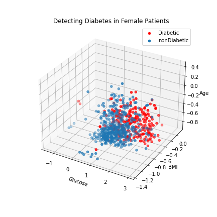
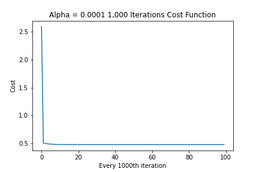
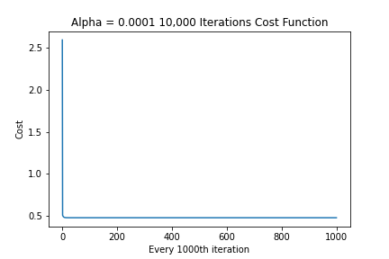

# Predicting-Who-Is-Diabetic
Dataset: [Kaggle Pima People Dataset](https://www.kaggle.com/datasets/uciml/pima-indians-diabetes-database)

**Problem Statement:** 
*My goal for this personal data project was to use binary classification/logistic regression model on a dataset originally from the National Institute of Diabetes and Digestive and Kidney Diseases about the Pima People to predict if patient has diabetes or not.*

**Impact**

This model will help predict the onset of diabetes in women who are a part of Pima People community.

**Stakeholders**
Health care professionals
Hospitals

**Scope (systems used)**
Jupyter Lab, Python, Supervised Learning: Classification, Logistic Regression, Matplotlib, Gradient Descent

**Metrics(what is being tracked)**
Available features from dataset are: Pregnancies, Blood Pressure, Glucose, BMI, Skin Thickness, Insulin, and Age

After various readings online I hypothesized BMI and Glucose will be the two best features used in conjuction to predict if a patient is diabetic or not.

**Key Milestones**

Trial 1: Only features used were Glucose and BMI, and a learning rate of 0.001

Description: During the first trial of 1,000 iterations with an alpha of 0.001 we see the cost jumping up and down
    - starting at 0.58, and increasing to 1.30 by the 100th iteration, when I J_history is printed out you can see the values fluctuating each iteration
    - if you only view each 100th iteration it will appear as if cost is constantly decreasing, this is not the case, visualizing every 99th value below to illustrate
    - if everything is set correctly cost function should never increase
    

Successes: With this trial I discovered a learning rate of 0.001 can give the false appearance of gradient descent working correctly(decreasing)

Failures: My cost function did not consistently decrease as intended 

Recommendations: Test for different learning rates that cause gradient descent to function as intended

- - - - - - - - - - - - - - -  

Trial 2: Only features used were Glucose and BMI, and a learning rate of 0.0001 at 1,000 , 10,000 , and 100,000 iterations

Successes: Adjusting my learning rate caused my cost to consistently decrease , visualized below

Failures: The lowest cost value achieved at 1,000, 10,000, and 100,000 iterations is 0.50 The object was to achieve a lower cost.

Visualize predicted data:

Recommendations: Test working model with 3 features (Chosen features are Glucose, BMI, & Age)

- - - - - - - - - - - - - - -  

Trial 3: Features used were Glucose BMI and Age, and a learning rate of 0.0001 at 1,000 , 10,000 , and 100,000 iterations

Visualize train data:

Successes: Adding additional feature caused cost to decrease a little more to 0.48

Failures: The lowest cost value achieved at 1,000, 10,000, and 100,000 iterations is 0.49 The object was to achieve a lower cost.

Recommendations: Lowest cost at optimal w & b is determined to be 0.48, adding an additional feature did improve model accuracy. I acheived a model score of 78.47%

**Tasks**

    1. Review data to get an initial understanding.
        - Do basic statistics.
            - Visualize patients with a postive diabetes test result(1) using original BMI vs Glucose
    2. Define Logistic Model
    3. Define Cost Function
    4. Defie Gradient Function
    5. Define Gradient Descent Function
    6. Define Prediction Function
    7. Store predicted results in dataframe and export csv
    8. Visualize predicted results.
    
    
**Recommendations**

*The model accuracy achieved with only BMI & Glucose as features is 76%*

