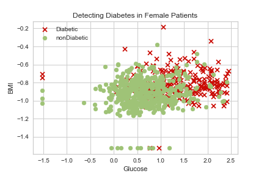
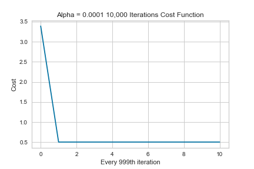

# Predicting-Who-Is-Diabetic
Dataset: [Kaggle Pima People Dataset](https://www.kaggle.com/datasets/uciml/pima-indians-diabetes-database)

*Problem Statement:* 
---
My goal for this personal data project was to use binary classification/logistic regression model on a dataset originally from the National Institute of Diabetes and Digestive and Kidney Diseases about the Pima People to predict if patient has diabetes or not.

*Impact*
---

This model will help predict the onset of diabetes in women who are a part of Pima People community.

*Stakeholders*
---
Health care professionals
Hospitals

*Systems used*
---
Jupyter Lab, Python, Supervised Learning: Classification, Logistic Regression, Matplotlib, Yellowbrick, Seaborn, Gradient Descent

## Metrics
---

*Get to know our dataset*
---
**Link to Tableau infographic:** [Pima-Women-Infographic](https://public.tableau.com/app/profile/dantrell.person/viz/Predicting-Diabetes-In-Pima-Women/Predicting-Diabetes-In-Pima-Women)

---

*Visualize available features*
---
*Available features are 'Pregnancies', 'Glucose', 'BloodPressure', 'SkinThickness', 'Insulin',
       'BMI', 'DiabetesPedigreeFunction', 'Age', & 'Outcome'*
       
Visualize a count of diabetic test results
---

---

Visualize feature importance 
---

---

Visualize age group frequency
---

---

Visualize BMI group frequency
---

---

Visualize Glucose group frequency
---

---

Utilize the Shapiro-Wilk algorithm to assess the normality of the distribution of instances with respect to the feature. A barplot is then drawn showing the relative ranks of each feature.
---

---

*Key Milestones*
---

Trial 1: Only features used were Glucose and BMI, and a learning rate of 0.001

Description: During the first trial of 1,000 iterations with an alpha of 0.001 we see the cost jumping up and down
    - starting at 0.62, and increasing to 1.30 by the 100th iteration, when I J_history is printed out you can see the values fluctuating each iteration
    - if you only view each 100th iteration it will appear as if cost is constantly decreasing, this is not the case, visualizing every 99th value below to illustrate
    - if everything is set correctly cost function should never increase
    

Successes: With this trial I discovered a learning rate of 0.001 can give the false appearance of gradient descent working correctly(decreasing)

Failures: My cost function did not consistently decrease as intended 

Recommendations: Test for different learning rates that cause gradient descent to function as intended

- - - - - - - - - - - - - - -  

**Trial 2:** Only features used were Glucose and BMI, and a learning rate of 0.0001 at 1,000 , 10,000 , and 100,000 iterations

Visualize train data:

Successes: Adjusting my learning rate caused my cost to consistently decrease , visualized below. The model accuracy achieved with only BMI & Glucose as features is 78.12%

- During the first trial of 1,000 iterations with an alpha of 0.0001 we see the cost start at 3.50 and consistently decreases to 0.50

- During the next trial of 10,000 iterations we see the cost start at 3.50 and decreases to 0.50, no change from 1000 iterations

- During the final trial of 100,000 iterations we see the cost start at 3.50 and decreases to 0.50

Visualize predicted data:

Failures: The lowest cost value achieved at 1,000, 10,000, and 100,000 iterations is 0.50 The object was to achieve a lower cost.

Recommendations: Test working model with 3 features (Chosen features are Glucose, BMI, & Age)

- - - - - - - - - - - - - - - 
Trial 3(adding Age as 3rd feature): Features used were Glucose BMI and Age, and a learning rate of 0.0001 at 1,000 , 10,000 , and 100,000 iterations

Visualize train data:

Successes: A lower cost of 0.48 was achieved. The model accuracy achieved with BMI, Glucose, & Age as features is 75.52%

- During the first trial of 1,000 iterations we see the cost start at 2.54 and decreases to 0.48

- During the next trial of 10,000 iterations we see the cost start at 2.44 and decreases to 0.50

- During the final trial of 100,000 iterations we see the cost start at 2.44 and decreases to 0.50

Visualize predicted data:

Failures: The model accuracy score is lower than Trial 2

Recommendations: Lowest cost at optimal w & b is determined to be 0.48. Adding the additional feature did not improve model accuracy, I recommend testing a new model using insulin as a fourth feature.

- - - - - - - - - - - - - - - 

Trial 4(adding Insulin as 4th feature): Features used were Glucose BMI and Insulin, and a learning rate of 0.0001 at 1,000 , 10,000 , and 100,000 iterations

Successes: While a lower cost was not achieved. The model accuracy achieved with BMI, Glucose, Age & Insulin as features is 78.13%

- During the first trial of 1,000 iterations we see the cost start at 2.50 and decreases to 0.50

- During the next trial of 10,000 iterations we see the cost start at 2.50 and decreases to 0.50, no difference from 1,000 iterations

- During the final trial of 100,000 iterations we see the cost start at 2.50 and decreases to 0.50, no difference from 1,000 iterations

Failures: The lowest cost value achieved at 1,000, 10,000, and 100,000 iterations is 0.50.

Recommendations: Lowest cost at optimal w & b is determined to be 0.50, adding an additional feature improved model accuracy from Trial 3. I acheived a model score of 78.13%. I recommend trying one final trial with all features to try and improve accuracy

- - - - - - - - - - - - - - -  
Trial 5(all avaiable variables):

Successes: Using all features available a cost of 0.49 and a model accuracy of 80.21% 

During the first trial of 1,000 iterations we see the cost start at 2.60 and decreases to 0.50

During the next trial of 10,000 iterations we see the cost start at 2.60 and decreases to 0.49.

During the next trial of 100,000 iterations we see the cost start at 2.60 and decreases to 0.49. No change from 10,000 iterations

Failures: The lowest cost value achieved at 1,000, 10,000, and 100,000 iterations is 0.49. Would have hoped it would be lower

Recommendations: Lowest cost at optimal w & b is determined to be 0.49, using all features improved model accuracy from Trial 3. I acheived a model score of 80.21%. I recommend using predicted data from this model.

- - - - - - - - - - - - - - - 

*Tasks*
---

    1. Review data to get an initial understanding.
        - Do basic statistics.
        - visualize how many patients are diabetic vs who aren't diabetic 
        - Visualize patients with a positive diabetes test result(1) and patients with a negative diabetes test result using original BMI vs Glucose
    2. Define Logistic Model
    3. Define Cost Function
    4. Define Gradient Function
    5. Define Gradient Descent Function
    6. Define Prediction Function
    7. Store predicted results in dataframe and export csv
    8. Visualize predicted results.
    9. Load Dataset into SQL database.
    
    
# Recommendations

*The model accuracy achieved with all availables features is **80.21%** after 5 trials I recommend moving forward with data predicted from Trial 5. 

